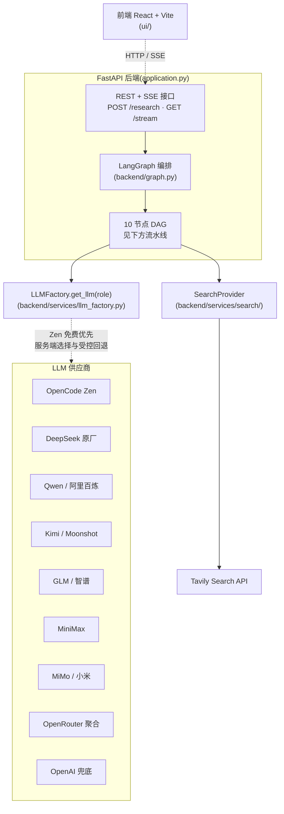

# 中文公司调研 Agent 🔍

> 🙏 **本项目基于 [guy-hartstein/company-research-agent](https://github.com/guy-hartstein/company-research-agent) (MIT License) 改造,由 Guy Hartstein 创作。**
>
> 主要差异:
> - 🇨🇳 **国产原厂直连** —— 支持 DeepSeek、Kimi、Qwen、GLM、MiniMax、MiMo,无需经过聚合平台
> - 🆓 **OpenCode Zen 免费优先** —— 部署者配置 Key 后优先使用 `deepseek-v4-flash-free`,可按需配置付费回退
> - 🌏 **聚合与原生兼容入口** —— 保留 [OpenRouter](https://openrouter.ai) 和 OpenAI,部署者可按网络、成本与合规要求选择
> - 🇨🇳 **Prompt 全量中文化** —— 不是机翻,人工重写,对国内模型更友好
> - 🎨 **UI 与示例公司中文化** —— 默认示例换成腾讯、字节、宁德时代、比亚迪
> - 🔌 **检索层抽象化** —— 引入 `SearchProvider` 接口,Phase 2 接 Bocha AI / AKShare / 巨潮资讯网 / 企查查 等国内数据源不再动节点代码


一个**多 agent 架构**的中文公司调研工具:输入一家公司的名字 → 自动产出一份面向投资 / BD / 竞品分析场景的全面调研报告。技术上基于 LangGraph 编排,通过流水线式的多个 AI 节点采集、过滤并合成信息。

> 原版在线 Demo(英文,可参考效果):https://companyresearcher.tavily.com

---

## ✨ 特性

- **多源调研**:从公司官网、新闻、财报、行业分析等多个来源采集信息
- **AI 内容过滤**:基于检索引擎打分 + LLM 二次评估
- **异步处理**:基于轮询/流式的进度跟踪架构
- **三段式 LLM 架构**(每节点可独立配置模型):
  - **Researcher**(搜集与初步分析)— 各供应商使用适合高频分析的当前模型
  - **Briefing**(分类摘要,长上下文)— 各供应商使用通用或长上下文模型
  - **Editor**(终稿编辑,严谨格式)— 各供应商使用高质量终稿模型
- **现代 React 前端**:进度跟踪、PDF 下载
- **模块化架构**:每个 agent 是独立的 LangGraph 节点,易于替换扩展
- **工商司法专业数据（预览）**:主体确认、预算账本、安全降级和确定性报告附录已经就绪；生产 QCC Provider 尚未完成真实响应适配,当前版本默认关闭

## 🆚 与原版的差异

本项目并非简单翻译,而是围绕"中国用户调研中国公司"这一场景的针对性改造。

| 维度 | 原版(`guy-hartstein/company-research-agent`) | 本项目 |
|---|---|---|
| 语言 | 英文 prompt + 英文 UI + 英文报告 | **中文** prompt + UI + 报告 |
| Prompt 质量 | 英文(中文公司用英文 prompt 时模型偏向英文资料) | **人工重写而非机翻**,占位符与下游解析依赖的标题(`### 核心产品/服务` 等)同步迁移,对国产模型更友好 |
| LLM provider | OpenAI(GPT 系列)+ Google(Gemini 系列)硬编码 | 统一 `LLMFactory.get_llm(role)`,**OpenCode Zen 免费优先 + 六家国产原厂 + OpenRouter / OpenAI 兼容兜底**；所有 Key 仅由部署者在服务端配置 |
| 模型成本控制 | 无 | **`LLM_MAX_TOKENS` 兜底**避免 OpenRouter 按模型最大窗口预扣余额导致小余额账号 402 |
| 检索层 | 直接调 Tavily 客户端,5 个文件分散调用 | **`SearchProvider` 抽象接口**,Tavily 收拢为默认 provider,新增 provider 无需改节点代码 |
| 启动校验 | 缺 key 运行时报错 | **启动期校验**,中文报错并立即退出 |
| 默认示例 | Apple、Stripe 等欧美公司 | 腾讯、字节跳动、宁德时代、比亚迪 |
| 国内可用性 | 需要科学上网调 OpenAI / Gemini | 可选六家国产原厂直连；OpenCode、OpenRouter、OpenAI 仍需评估网络与数据出境边界 |

---

## 🧠 Agent 框架

### 系统架构



### 调研流水线

10 个节点的有向无环图(DAG),并行 + 串行混合编排:


1. **入口节点 `GroundingNode`**:从用户输入抓取公司官网做初步定位(Tavily Crawl)
2. **4 个并行 Researcher**:
   - `CompanyAnalyzer`:核心业务、产品、团队
   - `IndustryAnalyzer`:行业地位、市场趋势、竞品
   - `FinancialAnalyst`:融资、营收、估值等财务指标
   - `NewsScanner`:近期新闻与重要事件
3. **后处理节点(串行)**:
   - `Collector`:汇总四路 researcher 结果
   - `Curator`:相关性过滤(默认阈值 0.4)
   - `Enricher`:对入选文档做内容补全
   - `Briefing`:生成 4 份分类摘要(用 briefing role LLM)
   - `Editor`:整合为终稿(用 editor role LLM,流式输出)


### 内容生成架构(三段式 LLM)

不同节点对模型能力需求不同,本项目通过 `LLMFactory.get_llm(role)` 按角色绑定模型:

| Role | OpenCode / OpenRouter 默认 slug | 原厂直连默认 | 用在哪 |
|---|---|---|---|
| `researcher` | `deepseek-v4-flash-free` / `deepseek/deepseek-v4-flash` | DeepSeek V4 Flash、Kimi K3、Qwen 3.7 Flash、GLM 4.7 Flash、MiniMax M3、MiMo 2.5、GPT-5.6 Luna | 4 个 researcher 节点搜集与分析 |
| `briefing` | `deepseek-v4-flash-free` / `qwen/qwen3.7-plus` | DeepSeek V4 Flash、Kimi K3、Qwen 3.7 Plus、GLM 4.7、MiniMax M3、MiMo 2.5、GPT-5.6 Terra | `briefing.py` 生成分类摘要 |
| `editor` | `deepseek-v4-flash-free` / `moonshotai/kimi-k3` | DeepSeek V4 Pro、Kimi K3、Qwen 3.7 Max、GLM 5.2、MiniMax M3、MiMo 2.5 Pro、GPT-5.6 Sol | `editor.py` 整合终稿(流式) |

> 配置示例见下方 [环境变量](#环境变量)。Web 用户不会看到供应商选择或 Key 输入；模型能力完全由部署者的服务端配置决定。

### 内容过滤系统

`backend/nodes/curator.py` 实现:

1. **相关性打分**:由检索引擎(默认 Tavily)在搜索时返回 score(0-1),低于阈值(默认 0.4)的文档过滤掉
2. **文档处理**:URL 去重、内容标准化、按相关度排序;调研全程异步执行

### 后端架构

基于 FastAPI + 异步任务,前端通过轮询 + 流式接口接收结果。


API 端点:

| 方法 | 路径 | 用途 |
|---|---|---|
| `POST` | `/research` | 提交调研请求,返回 `job_id` |
| `GET` | `/research/{job_id}` | 查询任务状态 |
| `GET` | `/research/{job_id}/stream` | 订阅进度流(SSE) |
| `GET` | `/research/{job_id}/report` | 拉取终稿报告 |
| `POST` | `/generate-pdf` | 生成 PDF |
| `GET` | `/capabilities` | 查询专业数据能力是否可用 |
| `POST` | `/companies/resolve` | 解析并确认公司主体；能力关闭时不会调用付费 Provider |

### 工商司法专业数据（预览）

专业数据分支采用部署者自备企查查 Key（BYOK）的设计。当前仓库已经实现主体确认、一次性 Token、幂等与预算准入、MongoDB 持久账本、MCP 传输边界、前端降级流程，以及工商司法事实的确定性报告附录。

当前版本**尚未完成生产 QCC Provider 的真实业务响应字段适配和应用生命周期装配**，所以 `/capabilities` 会返回不可用状态。请不要把填写 `QCC_API_KEY` 视为已经启用；在取得经过脱敏的官方工具真实响应样例并完成回归测试前，项目不会猜测上游字段，也不会执行未经部署者明确授权的付费 Smoke 测试。

项目不会抓取需要登录的爱企查、企查查网页或中国执行信息公开网，不保存第三方 Cookie，也不绕过验证码、限流或反自动化措施。专业分支不可用、预算受限或主体未确认时，基础 Web 调研仍会继续生成报告。

---

## 🚀 安装与运行

### 快速开始(推荐)

```bash
git clone https://github.com/BovmantH/cn-company-research-agent.git
cd cn-company-research-agent

chmod +x setup.sh
./setup.sh
```

`setup.sh` 会自动:

- 检测并优先使用 [`uv`](https://github.com/astral-sh/uv)(Python 包管理器,比 pip 快 10-100×)
- 检查 Python / Node.js 版本
- 创建虚拟环境(可选)
- 安装后端 + 前端依赖
- 引导你填写环境变量
- 一键启动两端服务

> **💡 提示**:用 `uv` 装依赖快很多。
>
> - macOS / Linux:`curl -LsSf https://astral.sh/uv/install.sh | sh`
> - Windows PowerShell:`powershell -ExecutionPolicy ByPass -c "irm https://astral.sh/uv/install.ps1 | iex"`

### 手动安装

```bash
# 1) 克隆
git clone https://github.com/BovmantH/cn-company-research-agent.git
cd cn-company-research-agent

# 2) 后端
uv venv .venv && source .venv/bin/activate    # 或 python -m venv .venv
uv pip install -r requirements.txt            # 或 pip install -r requirements.txt

# 3) 前端
cd ui && npm install && cd ..

# 4) 配置 .env(见下一节),然后:
uvicorn application:app --reload --port 8000     # 一个终端跑后端
cd ui && npm run dev                              # 另一个终端跑前端
# 访问 http://localhost:5174
```

### Docker 运行

构建单个生产镜像时，FastAPI 会同时提供 API 和前端静态文件，统一从 `8000` 端口访问：

```bash
docker build -t cn-company-research .
docker run --env-file .env -p 8000:8000 cn-company-research
# 访问 http://localhost:8000
```

本地联调可使用 Compose；它会额外启动 Vite 开发服务器：

```bash
git clone https://github.com/BovmantH/cn-company-research-agent.git
cd cn-company-research-agent

# 配好两个 .env 文件(根目录 + ui/),然后:
docker compose up --build
```

- API 与生产构建入口:`http://localhost:8000`
- Vite 开发入口:`http://localhost:5174`

修改 `.env` 后需要重启:`docker compose down && docker compose up`

---

## 🔧 环境变量

需要两个 `.env` 文件:**根目录**(后端)与 **`ui/.env`**(前端)。

### 根目录 `.env`(后端)

```env
# === LLM(必填:下方任意供应商 Key 至少配一个)===
# A) OpenCode Zen 限时免费优先
OPENCODE_API_KEY=sk-...

# B) 可选付费回退；只配置你愿意付费并已设置预算的供应商
# DEEPSEEK_API_KEY=sk-...
# MOONSHOT_API_KEY=sk-...       # Kimi K3
# DASHSCOPE_API_KEY=sk-...      # Qwen 3.7
# ZAI_API_KEY=...               # GLM 4.7 / 5.2
# MINIMAX_API_KEY=...           # MiniMax M3
# MIMO_API_KEY=...              # MiMo 2.5
# OPENROUTER_API_KEY=sk-or-...
# OPENAI_API_KEY=sk-...         # GPT-5.6

# 通用参数；温度默认不发送,由模型决定
LLM_STREAMING=true
LLM_MAX_TOKENS=4096
# LLM_BASE_URL=http://localhost:11434/v1   # 可选:走本地 vLLM / Ollama 等

# === 检索(必填)===
SEARCH_PROVIDER=tavily                                       # 默认 tavily,Phase 2 可选 bocha 等
TAVILY_API_KEY=tvly-...

# === 可选:MongoDB 持久化 ===
# MONGODB_URI=mongodb://localhost:27017/cn-research
```

完整变量列表见 [`.env.example`](.env.example)。

LLM Key 只应放在部署者控制的服务端 `.env` 或 Secret 中，不会下发到浏览器，Web 用户也不能选择供应商或填写 Key。

### `ui/.env`(前端)

```env
VITE_API_URL=http://localhost:8000
VITE_GOOGLE_MAPS_API_KEY=...                                 # 可选,LocationInput 用
```

可以从 `ui/.env.development.example` 复制起步。

### 国内访问 OpenRouter

OpenRouter 在中国大陆访问需要代理。最简单的办法是设置 `HTTPS_PROXY`:

```bash
export HTTPS_PROXY=http://127.0.0.1:7890
export HTTP_PROXY=http://127.0.0.1:7890
```

或者直接用国产模型 + 自己 host 的转发服务,把 `LLM_BASE_URL` 指过去即可。

### LLM 供应商与免费优先策略

只配置一家原厂 Key 时,三个角色均由该供应商承担。配置 OpenCode Zen 后,系统优先使用 `deepseek-v4-flash-free`；如果还配置了付费 Key,Zen 仅在首个流式响应块之前遇到受控的连接、鉴权、限流、模型不存在或服务端故障时回退。已经输出首块后不会切换供应商,避免重复或拼接报告。

```env
# 免费优先
OPENCODE_API_KEY=sk-...

# 按意愿配置付费候选；未配置的供应商绝不会被调用
DEEPSEEK_API_KEY=sk-...
MOONSHOT_API_KEY=sk-...
```

当前内置配置（核对于 2026-08-10）：

| Vendor | env key | 端点 | 默认 slug |
|---|---|---|---|
| **OpenCode Zen** | `OPENCODE_API_KEY` | `https://opencode.ai/zen/v1` | `deepseek-v4-flash-free` |
| **DeepSeek** | `DEEPSEEK_API_KEY` | `https://api.deepseek.com` | `deepseek-v4-flash` / `deepseek-v4-pro` |
| **Kimi**(Moonshot) | `MOONSHOT_API_KEY` | `https://api.moonshot.cn/v1` | `kimi-k3` |
| **Qwen**(阿里百炼) | `DASHSCOPE_API_KEY` | `https://dashscope.aliyuncs.com/compatible-mode/v1` | `qwen3.7-flash` / `qwen3.7-plus` / `qwen3.7-max` |
| **GLM**(智谱) | `ZAI_API_KEY` | `https://open.bigmodel.cn/api/paas/v4/` | `glm-4.7-flash` / `glm-4.7` / `glm-5.2` |
| **MiniMax** | `MINIMAX_API_KEY` | `https://api.minimaxi.com/v1` | `MiniMax-M3` |
| **MiMo**(小米) | `MIMO_API_KEY` | `https://api.xiaomimimo.com/v1` | `mimo-v2.5` / `mimo-v2.5-pro` |
| **OpenRouter** | `OPENROUTER_API_KEY` | `https://openrouter.ai/api/v1` | DeepSeek V4 / Qwen 3.7 / Kimi K3 |
| **OpenAI** | `OPENAI_API_KEY` | `https://api.openai.com/v1` | `gpt-5.6-luna` / `gpt-5.6-terra` / `gpt-5.6-sol` |

OpenCode Zen 的免费型号是**限时免费**，服务托管在美国，免费期间提交的数据可能用于模型改进。不要发送个人、机密或受合同/监管限制的数据；部署前请复核 [Zen 官方说明](https://opencode.ai/docs/zen)。如果启用付费回退,请在对应平台设置预算、月度限额，并谨慎配置或关闭自动充值。

进阶选项:

```env
# 自动模式下 OpenCode 始终优先；这里调整其后的付费顺序
LLM_VENDOR_PRIORITY=kimi,deepseek,qwen,glm,minimax,mimo,openrouter,openai

# 锁死一家,同时关闭跨供应商回退
LLM_VENDOR=deepseek

# 走自建网关(OneAPI / LiteLLM)代理某一家:
LLM_BASE_URL_DEEPSEEK=http://localhost:3000/v1
```

设置全局 `LLM_BASE_URL`、代码级 `model` 或连接/认证类覆盖参数时，工厂会进入单供应商模式并关闭跨供应商回退，防止同一个模型名、Key 或 Authorization 头被发送到不同端点。若需要保留安全回退，请使用 `LLM_BASE_URL_<VENDOR>` 分别配置各供应商。

完整说明见 [`.env.example`](.env.example) 第 1~4 节。

---

## 🌐 部署

平台无关,常见选择:

- **Docker**:仓库自带 `Dockerfile` 与 `docker-compose.yml`
- **AWS Elastic Beanstalk**:`pip install awsebcli && eb init && eb create`
- **Google Cloud Run** / **Render** / **Railway**:容器化部署友好
- **国内部署**:阿里云函数计算 / 腾讯云 SCF / 自建 K8s

> ⚠️ 国内服务器使用 OpenCode Zen、OpenRouter 或 OpenAI 前,请先确认网络可达性、数据出境要求和供应商隐私政策。

---

## 🤝 贡献

1. Fork 仓库
2. 创建 feature 分支:`git checkout -b feat/your-feature`
3. 提交:`git commit -m 'feat: ...'`(中文 commit message 也欢迎)
4. 推送并开 PR:`git push origin feat/your-feature`

## 📜 License

MIT License,与原项目一致。详见 [LICENSE](LICENSE)。

原版权声明保留:`Copyright (c) Guy Hartstein`(完整内容见 LICENSE 文件)。本中文化版本由后续贡献者在 MIT 协议下补充。

## 🙏 致谢

- **[Guy Hartstein](https://github.com/guy-hartstein)** —— 原项目作者,本仓库的所有架构骨架来自 [`guy-hartstein/company-research-agent`](https://github.com/guy-hartstein/company-research-agent)
- **[Tavily](https://tavily.com/)** —— 默认检索 provider
- **[OpenRouter](https://openrouter.ai/)** —— 统一 LLM 网关
- 所有底层开源依赖的维护者们

---

> 📍 **项目状态**:中文 Prompt/UI、LLM 工厂、六家国产原厂、OpenCode 免费优先回退、OpenRouter/OpenAI 兼容入口及检索抽象均已完成离线测试。仓库不会自动执行消耗额度或发送真实报告数据的供应商 Smoke 测试；部署者上线前应使用自己的测试数据逐家验收网络、模型兼容性、费用和数据政策。
