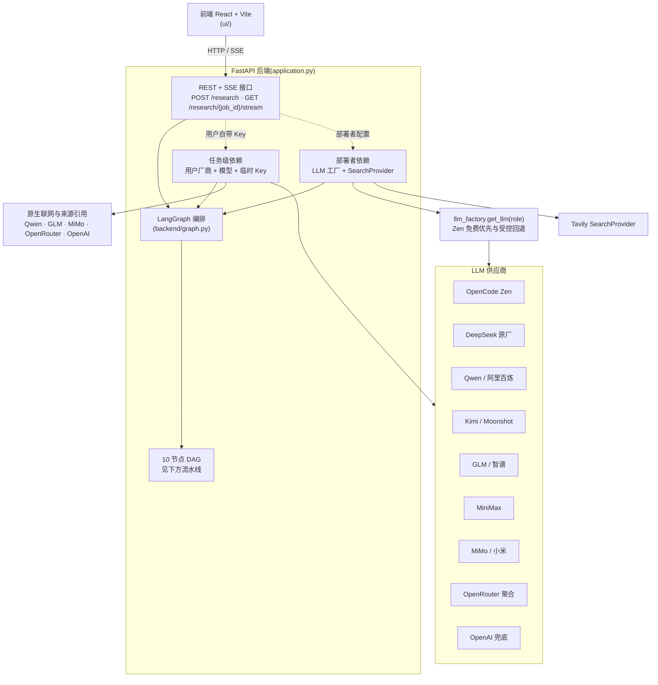
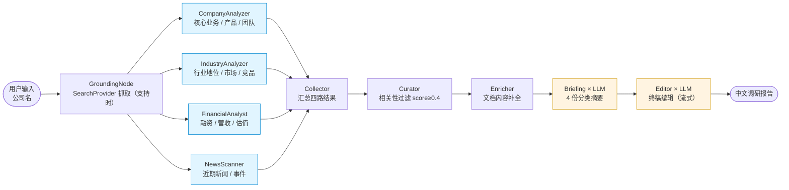

# 中国公司深度调研 Agent 🔍

> 🙏 **本项目基于 [guy-hartstein/company-research-agent](https://github.com/guy-hartstein/company-research-agent)（Apache License 2.0）改造，由 Guy Hartstein 创作。**
>
> 主要差异：
>
> - 🇨🇳 **国产原厂直连** —— 服务端支持 DeepSeek、Kimi、Qwen、GLM、MiniMax、MiMo，无需经过聚合平台
> - 🆓 **OpenCode Zen 免费优先** —— 部署者配置 Key 后优先使用 `deepseek-v4-flash-free`，可按需配置付费回退
> - 🌏 **聚合与原生兼容入口** —— 保留 [OpenRouter](https://openrouter.ai) 和 OpenAI，部署者可按网络、成本与合规要求选择
> - 🔐 **任务级用户 Key** —— Web 用户可为单次任务选择厂商与模型；Key 不持久化、不写应用日志，也可继续使用部署者的服务端配置
> - 🇨🇳 **Prompt 全量中文化** —— 不是机翻，人工重写，对国内模型更友好
> - 🎨 **中文 UI 与示例** —— 默认提供苹果、字节跳动、宁德时代、比亚迪等一键示例
> - 🔌 **任务级原生联网** —— Qwen、GLM、MiMo、OpenRouter、OpenAI 可用同一把用户 Key 完成模型生成、网页搜索与来源引用


> 当前界面会根据后端返回的厂商能力和模型目录动态渲染。截图中的模型清单只代表拍摄时的可用状态。

一个**多 Agent 架构**的中文公司调研工具：输入公司名称，自动产出面向投资、BD 和竞品分析场景的调研报告。项目基于 LangGraph 编排多个 AI 节点，按流水线采集、过滤并合成公开信息。

> 原版在线 Demo（英文，可参考效果）：[companyresearcher.tavily.com](https://companyresearcher.tavily.com/)

---

## ✨ 特性

- **多源调研**：从公司官网、新闻、财报和行业分析等公开来源采集信息
- **来源引用**：只接收适配器能够归属到具体网页的来源，不把模型生成的链接冒充引用
- **异步处理**：后台任务与可重放 SSE 进度流并行工作，断线后可从事件游标继续
- **三段式 LLM 架构**（服务端可按角色配置，Web BYOK 使用任务模型）：
  - **Researcher**（搜集与初步分析）— 各供应商使用适合高频分析的当前模型
  - **Briefing**（分类摘要、长上下文）— 各供应商使用通用或长上下文模型
  - **Editor**（终稿编辑、严谨格式）— 各供应商使用高质量终稿模型
- **现代 React 前端**：厂商与模型选择、进度跟踪、报告复制和 PDF 下载
- **动态模型目录**：优先读取厂商官方目录；Qwen、GLM 使用项目集中维护的能力清单
- **用户自带 Key**：临时 Key 仅在任务处理期间驻留内存，不持久化、不写应用日志
- **模块化架构**：每个 Agent 是独立的 LangGraph 节点，模型与检索依赖按任务注入
- **工商司法专业数据（预览）**：主体确认、预算账本、安全降级和确定性附录已就绪；生产 QCC Provider 尚未装配，默认关闭

## 🆚 与原版的差异

本项目并非简单翻译，而是围绕“中国用户调研中国公司”这一场景进行针对性改造。

| 维度 | 原版（`guy-hartstein/company-research-agent`） | 本项目 |
| --- | --- | --- |
| 语言 | 英文 prompt + 英文 UI + 英文报告 | **中文** prompt + UI + 报告 |
| Prompt 质量 | 英文（中文公司用英文 prompt 时模型偏向英文资料） | **人工重写而非机翻**，占位符与下游解析依赖的标题（`### 核心产品/服务` 等）同步迁移，对国产模型更友好 |
| LLM 供应商 | OpenAI（GPT 系列）+ Google（Gemini 系列）硬编码 | 统一 `backend.services.llm_factory.get_llm(role)`，支持 **OpenCode Zen 免费优先 + 六家国产原厂 + OpenRouter / OpenAI 兼容兜底**；同时支持部署者配置和任务级用户 Key |
| 模型成本控制 | 无 | **`LLM_MAX_TOKENS` 兜底**避免 OpenRouter 按模型最大窗口预扣余额导致小余额账号 402 |
| 检索层 | 直接调 Tavily 客户端，5 个文件分散调用 | **`SearchProvider` 抽象接口**；部署者模式默认 Tavily，用户模式已接入 5 家同 Key 原生联网适配器 |
| 启动校验 | 缺 Key 时到运行阶段才报错 | 声明服务端模型配置时进行**启动期校验**；未配置时仍可运行纯 Web BYOK 模式 |
| 默认示例 | Apple、Stripe 等欧美公司 | 苹果、字节跳动、宁德时代、比亚迪等 |
| 国内可用性 | 需要科学上网调 OpenAI / Gemini | 可选六家国产原厂直连；OpenCode、OpenRouter、OpenAI 仍需评估网络与数据出境边界 |

---

## 🧠 Agent 框架

### 系统架构



### 调研流水线

10 个节点的有向无环图（DAG），采用并行与串行混合编排：



1. **入口节点 `GroundingNode`**：从用户输入建立公司背景；Provider 支持 `crawl` 时抓取公司官网，不支持时安全降级
2. **4 个并行 Researcher**：
   - `CompanyAnalyzer`：核心业务、产品、团队
   - `IndustryAnalyzer`：行业地位、市场趋势、竞品
   - `FinancialAnalyst`：融资、营收、估值等财务指标
   - `NewsScanner`：近期新闻与重要事件
3. **后处理节点（串行）**：
   - `Collector`：汇总四路 Researcher 结果
   - `Curator`：相关性过滤（默认阈值 0.4）
   - `Enricher`：对入选文档做内容补全
   - `Briefing`：生成 4 份分类摘要（使用 briefing role LLM）
   - `Editor`：整合为终稿（使用 editor role LLM，流式输出）


### 内容生成架构（三段式 LLM）

不同节点对模型能力的需求不同。部署者模式通过 `llm_factory.get_llm(role)` 按角色绑定模型；用户 BYOK 模式则让三个角色使用本次任务选定的同一家厂商和模型。

| Role | 能力侧重 | 用在哪 |
| --- | --- | --- |
| `researcher` | 高频检索与初步分析 | 4 个 Researcher 节点搜集与分析 |
| `briefing` | 分类摘要与长上下文 | `briefing.py` 生成分类摘要 |
| `editor` | 长报告编辑与格式稳定性 | `editor.py` 整合终稿（流式） |

> 配置示例见下方 [环境变量](#-环境变量)。Web 用户可以选择“用户自带 Key”或“使用部署者配置”。用户模式只访问后端固定的官方端点，不继承部署者的付费回退链。

### 内容过滤系统

`backend/nodes/curator.py` 实现：

1. **相关性打分**：由 `SearchProvider` 返回或按来源排名标准化为 `score`（0-1），低于默认阈值 0.4 的文档会被过滤
2. **文档处理**：URL 去重、内容标准化、按相关度排序；调研全程异步执行

### 后端架构

后端基于 FastAPI 与异步任务运行，前端通过 REST 提交任务，并使用可重放 SSE 接收进度和终稿。

API 端点：

| 方法 | 路径 | 用途 |
| --- | --- | --- |
| `POST` | `/research` | 提交调研请求，返回 `job_id` |
| `GET` | `/ai/providers` | 返回前端可展示的厂商能力，不含端点或 Key |
| `POST` | `/ai/models` | 使用当前用户临时 Key 读取模型目录 |
| `GET` | `/research/{job_id}` | 从 MongoDB 查询历史任务；未配置 MongoDB 时返回 501 |
| `GET` | `/research/{job_id}/stream` | 订阅进度流（SSE） |
| `GET` | `/research/{job_id}/report` | 拉取终稿报告 |
| `POST` | `/generate-pdf` | 生成 PDF |
| `GET` | `/research/pdf/{filename}` | 下载已生成的 PDF |
| `GET` | `/health` | 健康检查，不调用模型或付费 Provider |
| `GET` | `/capabilities` | 查询专业数据能力是否可用 |
| `POST` | `/companies/resolve` | 解析并确认公司主体；能力关闭时不会调用付费 Provider |

### 工商司法专业数据（预览）

专业数据分支采用部署者自备企查查 Key（BYOK）的设计。当前仓库已经实现主体确认、一次性 Token、幂等与预算准入、MongoDB 持久账本、MCP 传输边界、前端降级流程，以及工商司法事实的确定性报告附录。

当前版本**尚未完成生产 QCC Provider 的真实业务响应字段适配和应用生命周期装配**，所以 `/capabilities` 会返回不可用状态。请不要把填写 `QCC_API_KEY` 视为已经启用；在取得经过脱敏的官方工具真实响应样例并完成回归测试前，项目不会猜测上游字段，也不会执行未经部署者明确授权的付费 Smoke 测试。

项目不会抓取需要登录的爱企查、企查查网页或中国执行信息公开网，不保存第三方 Cookie，也不绕过验证码、限流或反自动化措施。专业分支不可用、预算受限或主体未确认时，基础 Web 调研仍会继续生成报告。

---

## 🚀 安装与运行

运行要求：Python 3.11+、Node.js 18+。仅使用 Web 用户 Key 时，无需预先创建 `.env`。

### Web BYOK 快速开始（推荐）

macOS / Linux：

```bash
git clone https://github.com/BovmantH/cn-company-research-agent.git
cd cn-company-research-agent

python3 -m venv .venv
source .venv/bin/activate
python -m pip install -r requirements.txt
npm --prefix ui install

# 终端 1：启动后端
python -m uvicorn application:app --reload --port 8000

# 终端 2：启动前端
npm --prefix ui run dev
```

Windows PowerShell：

```powershell
git clone https://github.com/BovmantH/cn-company-research-agent.git
Set-Location cn-company-research-agent

py -3.11 -m venv .venv
.\.venv\Scripts\python.exe -m pip install -r requirements.txt
npm --prefix ui install

# 终端 1：启动后端
.\.venv\Scripts\python.exe -m uvicorn application:app --reload --port 8000

# 终端 2：启动前端
npm --prefix ui run dev
```

访问 <http://localhost:5174>，选择 Qwen、GLM、MiMo、OpenRouter 或 OpenAI，填写该厂商的普通 API Key，再加载模型并提交调研。

### 服务端配置向导（macOS / Linux / WSL）

`setup.sh` 会检查版本、安装依赖、收集 Tavily 与一个 LLM Key，并可同时启动前后端。它面向“使用部署者配置”模式；纯 Web BYOK 不需要运行该向导。

```bash
chmod +x setup.sh
./setup.sh
```

### Docker 运行

构建单个生产镜像时，FastAPI 会同时提供 API 和前端静态文件，统一从 `8000` 端口访问：

```bash
docker build -t cn-company-research .

# 纯 Web BYOK
docker run --rm -p 8000:8000 cn-company-research

# 使用部署者配置时改为
docker run --rm --env-file .env -p 8000:8000 cn-company-research
```

访问 <http://localhost:8000>。

本地联调可使用 Compose；它会额外启动 Vite 开发服务器：

```bash
git clone https://github.com/BovmantH/cn-company-research-agent.git
cd cn-company-research-agent

# Compose 声明了根目录 .env；先从模板复制并按需填写
cp .env.example .env
docker compose up --build
```

- API 与生产构建入口：<http://localhost:8000>
- Vite 开发入口：<http://localhost:5174>

修改 `.env` 后需要重建容器环境：`docker compose down && docker compose up --build`。

---

## 🔧 环境变量

两个配置文件都不是纯 Web BYOK 的启动前提。根目录 `.env` 用于部署者模型、Tavily、MongoDB 和专业数据配置；`ui/.env` 仅在前后端不同源或需要 Google Maps 自动补全时使用。

### 根目录 `.env`（后端）

```env
# === 服务端 LLM（可选；仅使用 Web 用户 Key 时全部留空）===
# OpenCode Zen 限时免费优先
# OPENCODE_API_KEY=sk-...

# 可选付费候选；只配置你愿意付费并已设置预算的供应商
# DEEPSEEK_API_KEY=sk-...
# MOONSHOT_API_KEY=sk-...       # Kimi K3
# DASHSCOPE_API_KEY=sk-...      # Qwen 3.7
# ZAI_API_KEY=...               # GLM 4.7 / 5.2
# MINIMAX_API_KEY=...           # MiniMax M3
# MIMO_API_KEY=...              # MiMo 2.5
# OPENROUTER_API_KEY=sk-or-...
# OPENAI_API_KEY=sk-...         # GPT-5.6

# 通用参数；温度默认不发送，由模型决定
# LLM_MAX_TOKENS=4096
# LLM_BASE_URL=http://localhost:11434/v1   # 可选：本地 vLLM / Ollama 等

# === 部署者模式检索（使用服务端配置时必填）===
# 当前服务端工厂只注册 tavily
# SEARCH_PROVIDER=tavily
# TAVILY_API_KEY=tvly-...

# === 可选：MongoDB 持久化 ===
# MONGODB_URI=mongodb://localhost:27017/cn-research
```

完整变量列表见 [`.env.example`](.env.example)。

部署者 Key 只应放在服务端 `.env` 或 Secret 中，不会下发到浏览器。用户临时 Key 会先发送给当前部署实例，再由后端访问固定的厂商官方端点；它只在本次任务处理期间驻留内存，不写入 MongoDB、任务状态、SSE 或应用日志。

公开部署必须使用 HTTPS。用户应只在可信部署实例中填写 Key。Python 无法承诺对字符串内存做物理擦除，因此项目不会使用“绝不留在内存”这类不准确表述。

### `ui/.env`（前端）

```env
# 前后端同源或使用仓库内 Vite 代理时可以不设置
VITE_API_URL=http://localhost:8000
VITE_GOOGLE_MAPS_API_KEY=...                                 # 可选：地点自动补全
```

需要时直接创建 `ui/.env` 或 `ui/.env.development`。不要把真实 Key 提交到仓库。

### 国内访问 OpenRouter

部分中国大陆网络无法稳定直连 OpenRouter。部署者可在确认网络与合规边界后设置代理：

```bash
export HTTPS_PROXY=http://127.0.0.1:7890
export HTTP_PROXY=http://127.0.0.1:7890
```

也可以使用国产原厂，或把 `LLM_BASE_URL_<VENDOR>` 指向自建的 OneAPI / LiteLLM 网关。设置全局 `LLM_BASE_URL` 会进入单供应商模式并关闭跨供应商回退。

### LLM 供应商与免费优先策略

只配置一家原厂 Key 时，三个角色均由该供应商承担。配置 OpenCode Zen 后，系统优先使用 `deepseek-v4-flash-free`；如果还配置了付费 Key，Zen 仅在首个流式响应块之前遇到受控的连接、鉴权、限流、模型不存在或服务端故障时回退。已经输出首块后不会切换供应商，避免重复或拼接报告。

```env
# 免费优先
OPENCODE_API_KEY=sk-...

# 按意愿配置付费候选；未配置的供应商绝不会被调用
DEEPSEEK_API_KEY=sk-...
MOONSHOT_API_KEY=sk-...
```

当前内置配置（核对日期：2026-08-11，以 `backend/services/llm_factory.py` 中的 `VENDOR_REGISTRY` 为准）：

| 供应商 | 服务端环境变量 | 端点 | 默认模型标识 |
| --- | --- | --- | --- |
| **OpenCode Zen** | `OPENCODE_API_KEY` | `https://opencode.ai/zen/v1` | `deepseek-v4-flash-free` |
| **DeepSeek** | `DEEPSEEK_API_KEY` | `https://api.deepseek.com` | `deepseek-v4-flash` / `deepseek-v4-pro` |
| **Kimi**（Moonshot） | `MOONSHOT_API_KEY` | `https://api.moonshot.cn/v1` | `kimi-k3` |
| **Qwen**（阿里百炼） | `DASHSCOPE_API_KEY` | `https://dashscope.aliyuncs.com/compatible-mode/v1` | `qwen3.7-flash` / `qwen3.7-plus` / `qwen3.7-max` |
| **GLM**（智谱） | `ZAI_API_KEY` | `https://open.bigmodel.cn/api/paas/v4/` | `glm-4.7-flash` / `glm-4.7` / `glm-5.2` |
| **MiniMax** | `MINIMAX_API_KEY` | `https://api.minimaxi.com/v1` | `MiniMax-M3` |
| **MiMo**（小米） | `MIMO_API_KEY` | `https://api.xiaomimimo.com/v1` | `mimo-v2.5` / `mimo-v2.5-pro` |
| **OpenRouter** | `OPENROUTER_API_KEY` | `https://openrouter.ai/api/v1` | DeepSeek V4 / Qwen 3.7 / Kimi K3 |
| **OpenAI** | `OPENAI_API_KEY` | `https://api.openai.com/v1` | `gpt-5.6-luna` / `gpt-5.6-terra` / `gpt-5.6-sol` |

#### Web 用户模型目录与联网边界

- OpenCode Zen、DeepSeek、Kimi、MiniMax、MiMo、OpenRouter、OpenAI：通过各厂商的官方模型列表 API 动态读取，前端不写死模型列表。
- Qwen、GLM：当前没有适合普通按量推理选择器的可靠官方模型目录 API，因此后端集中维护推荐清单，界面明确标为“项目维护的推荐清单”。
- 动态目录只说明 Key 能读取哪些模型，不自动证明模型适合本项目的联网和引用契约。当前 Web 用户单 Key 联网已开放 Qwen、GLM、MiMo、OpenRouter 和 OpenAI；后端会按厂商能力清单过滤可提交模型。
- OpenCode Zen、DeepSeek、Kimi 和 MiniMax 当前只开放模型目录查看，界面统一标记为“暂未开放联网调研”。项目不会把模型生成的链接冒充可验证来源。
- 用户 Key 同时承担所选厂商的模型生成和原生联网费用。GLM 联网检索、MiMo Web Search 插件、OpenRouter Server Tool 和 OpenAI Web Search 均可能单独计费；MiMo 还需先在原厂控制台开通 Web Search 插件。价格和可用政策以厂商实时说明为准。
- 选择“使用部署者配置”时继续使用服务端 LLM 与 `SearchProvider`；在默认配置下，部署者仍需分别承担 LLM 和 Tavily 检索费用。

OpenCode Zen 的免费型号是**限时免费**，服务托管在美国，免费期间提交的数据可能用于模型改进。不要发送个人、机密或受合同/监管限制的数据；部署前请复核 [Zen 官方说明](https://opencode.ai/docs/zen)。如果启用付费回退，请在对应平台设置预算、月度限额，并谨慎配置或关闭自动充值。

进阶选项：

```env
# 自动模式下 OpenCode 始终优先；这里调整其后的付费顺序
LLM_VENDOR_PRIORITY=kimi,deepseek,qwen,glm,minimax,mimo,openrouter,openai

# 锁死一家，同时关闭跨供应商回退
LLM_VENDOR=deepseek

# 走自建网关（OneAPI / LiteLLM）代理某一家：
LLM_BASE_URL_DEEPSEEK=http://localhost:3000/v1
```

设置全局 `LLM_BASE_URL`、代码级 `model` 或连接/认证类覆盖参数时，工厂会进入单供应商模式并关闭跨供应商回退，防止同一个模型名、Key 或 Authorization 头被发送到不同端点。若需要保留安全回退，请使用 `LLM_BASE_URL_<VENDOR>` 分别配置各供应商。

完整说明见 [`.env.example`](.env.example) 第 1~4 节。

---

## 🌐 生产部署

正式部署建议使用长期运行的 Linux 服务器或支持常驻容器的平台。仓库内的 `Dockerfile` 会把 React 前端和 FastAPI 后端打进同一个镜像，并统一通过 `8000` 端口提供服务。GitHub Pages 只能托管静态页面，不能单独运行本项目的 FastAPI、后台任务和 SSE。

上线前至少完成以下检查：

- 使用 HTTPS，并确认反向代理不会记录请求体、`Authorization` 或用户临时 Key
- 为 SSE 关闭代理缓冲并设置足够长的读取超时
- 把部署者 Key 放入平台 Secret，不写入镜像、仓库或前端环境变量
- 当前活动任务与 SSE 事件保存在单进程内存中，生产环境应先运行单个应用实例；重启会丢失活动状态，终态默认仅保留 1 小时
- MongoDB 可持久化任务记录和报告，但当前版本不支持依靠 MongoDB 在多实例之间接管活动任务或重放 SSE
- 为模型、联网搜索和专业数据分别设置预算与供应商侧限额
- 在启用 OpenCode Zen、OpenRouter 或 OpenAI 前，核对网络可达性、数据出境要求和供应商隐私政策

工商司法专业数据仍是默认关闭的预览能力。即使填写 `QCC_API_KEY`，在生产 Provider 完成真实响应适配与装配前也不会对外宣称可用。

---

## 🤝 贡献

1. Fork 仓库
2. 创建功能分支：`git checkout -b feat/your-feature`
3. 按 Conventional Commits 提交：type 与 scope 使用英文小写，冒号后使用中文说明，例如 `feat(search): 增加新的联网适配器`
4. 推送并创建 Pull Request：`git push origin feat/your-feature`

## 📜 License

Apache License 2.0，与原项目一致。详见 [LICENSE](LICENSE)。

原版权声明保留：`Copyright 2025 Guy Hartstein`。本项目沿用 Apache License 2.0，完整授权条款与声明见 LICENSE 文件。

## 🙏 致谢

- **[Guy Hartstein](https://github.com/guy-hartstein)** —— 原项目作者，本仓库的架构骨架来自 [`guy-hartstein/company-research-agent`](https://github.com/guy-hartstein/company-research-agent)
- **[Tavily](https://tavily.com/)** —— 部署者模式的默认检索 Provider
- **[OpenRouter](https://openrouter.ai/)** —— 可选的聚合模型与联网入口
- 所有底层开源依赖的维护者们

---

> 📍 **项目状态**：中文 Prompt/UI、LLM 工厂、六家国产原厂、OpenCode 免费优先回退、OpenRouter/OpenAI 兼容入口、检索抽象，以及 Qwen、GLM、MiMo、OpenRouter、OpenAI 五家任务级联网适配器均已通过离线测试。仓库不会自动执行消耗额度或发送真实报告数据的供应商 Smoke 测试；部署者上线前应使用自己的测试数据逐家验收网络、模型兼容性、费用和数据政策。
