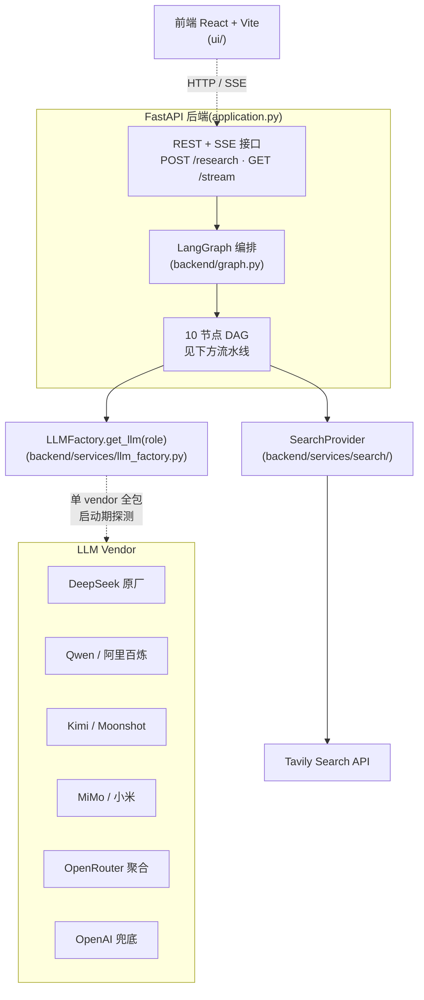
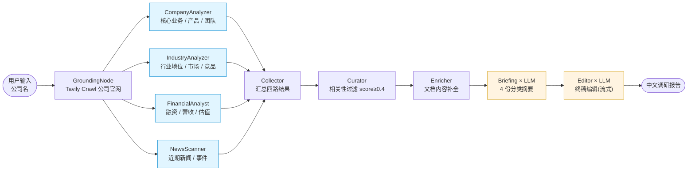

# 中文公司调研 Agent 🔍

> 🙏 **本项目基于 [guy-hartstein/company-research-agent](https://github.com/guy-hartstein/company-research-agent) (MIT License) 改造,由 Guy Hartstein 创作。**
>
> 主要差异:
> - 🇨🇳 **国产原厂直连** —— 拿 DeepSeek / Qwen / Kimi 原厂 key 即可直跑,无需 OpenRouter / 代理(Phase 2)
> - 🌏 **LLM 走 [OpenRouter](https://openrouter.ai)** —— 国内 DeepSeek / Qwen / Kimi / 智谱 与国外 GPT / Claude / Gemini 通过同一接口切换
> - 🇨🇳 **Prompt 全量中文化** —— 不是机翻,人工重写,对国内模型更友好
> - 🎨 **UI 与示例公司中文化** —— 默认示例换成腾讯、字节、宁德时代、比亚迪
> - 🔌 **检索层抽象化** —— 引入 `SearchProvider` 接口,Phase 2 接 Bocha AI / AKShare / 巨潮资讯网 / 企查查 等国内数据源不再动节点代码


一个**多 agent 架构**的中文公司调研工具:输入一家公司的名字 → 自动产出一份面向投资 / BD / 竞品分析场景的全面调研报告。技术上基于 LangGraph 编排,通过流水线式的多个 AI 节点采集、过滤并合成信息。

> 原版在线 Demo(英文,可参考效果):https://companyresearcher.tavily.com

---

## ✨ 特性

- **多源调研**:从公司官网、新闻、财报、行业分析等多个来源采集信息
- **AI 内容过滤**:基于检索引擎打分 + LLM 二次评估
- **异步处理**:基于轮询/流式的进度跟踪架构
- **三段式 LLM 架构**(每节点可独立配置模型):
  - **Researcher**(搜集与初步分析)— 默认 `deepseek-v4-flash`,快且便宜,1M 上下文
  - **Briefing**(分类摘要,长上下文)— 默认 `qwen3.6-plus` / `qwen/qwen3.6-flash`(走 OpenRouter)
  - **Editor**(终稿编辑,严谨格式)— 默认 `kimi-k2.5` / `moonshotai/kimi-k2.6`(走 OpenRouter)
- **现代 React 前端**:进度跟踪、PDF 下载
- **模块化架构**:每个 agent 是独立的 LangGraph 节点,易于替换扩展

## 🆚 与原版的差异

本项目并非简单翻译,而是围绕"中国用户调研中国公司"这一场景的针对性改造。

| 维度 | 原版(`guy-hartstein/company-research-agent`) | 本项目 |
|---|---|---|
| 语言 | 英文 prompt + 英文 UI + 英文报告 | **中文** prompt + UI + 报告 |
| Prompt 质量 | 英文(中文公司用英文 prompt 时模型偏向英文资料) | **人工重写而非机翻**,占位符与下游解析依赖的标题(`### 核心产品/服务` 等)同步迁移,对国产模型更友好 |
| LLM provider | OpenAI(GPT 系列)+ Google(Gemini 系列)硬编码 | 统一 `LLMFactory.get_llm(role)`,**国产原厂直连(DeepSeek / Qwen / Kimi / MiMo)+ OpenRouter 聚合 + OpenAI 兜底**,启动期单 vendor 全包 |
| 模型成本控制 | 无 | **`LLM_MAX_TOKENS` 兜底**避免 OpenRouter 按模型最大窗口预扣余额导致小余额账号 402 |
| 检索层 | 直接调 Tavily 客户端,5 个文件分散调用 | **`SearchProvider` 抽象接口**,Tavily 收拢为默认 provider,新增 provider 无需改节点代码 |
| 启动校验 | 缺 key 运行时报错 | **启动期校验**,中文报错并立即退出 |
| 默认示例 | Apple、Stripe 等欧美公司 | 腾讯、字节跳动、宁德时代、比亚迪 |
| 国内可用性 | 需要科学上网调 OpenAI / Gemini | OpenRouter + 国产模型可纯境内跑通 |

---

## 🧠 Agent 框架

### 系统架构



### 调研流水线

10 个节点的有向无环图(DAG),并行 + 串行混合编排:



1. **入口节点 `GroundingNode`**:从用户输入抓取公司官网做初步定位(Tavily Crawl)
2. **4 个并行 Researcher**:
   - `CompanyAnalyzer`:核心业务、产品、团队
   - `IndustryAnalyzer`:行业地位、市场趋势、竞品
   - `FinancialAnalyst`:融资、营收、估值等财务指标
   - `NewsScanner`:近期新闻与重要事件
3. **后处理节点(串行)**:
   - `Collector`:汇总四路 researcher 结果
   - `Curator`:相关性过滤(默认阈值 0.4)
   - `Enricher`:对入选文档做内容补全
   - `Briefing`:生成 4 份分类摘要(用 briefing role LLM)
   - `Editor`:整合为终稿(用 editor role LLM,流式输出)


### 内容生成架构(三段式 LLM)

不同节点对模型能力需求不同,本项目通过 `LLMFactory.get_llm(role)` 按角色绑定模型:

| Role | OpenRouter 默认 slug | 原厂直连默认(DeepSeek / Qwen / Kimi / MiMo) | 用在哪 |
|---|---|---|---|
| `researcher` | `deepseek/deepseek-v4-flash` | `deepseek-v4-flash` / `qwen3.6-flash` / `kimi-k2.5` / `mimo-v2.5-pro` | 4 个 researcher 节点搜集与分析 |
| `briefing` | `qwen/qwen3.6-flash` | `deepseek-v4-flash` / `qwen3.6-plus` / `kimi-k2-turbo-preview` / `mimo-v2.5-pro` | `briefing.py` 生成分类摘要 |
| `editor` | `moonshotai/kimi-k2.6` | `deepseek-v4-flash` / `qwen3-max` / `kimi-k2.5` / `mimo-v2.5-pro` | `editor.py` 整合终稿(流式) |

> 配置示例见下方 [环境变量](#环境变量)。如果你只有 OpenAI Key,工厂会自动降级到原生 OpenAI 端点。

### 内容过滤系统

`backend/nodes/curator.py` 实现:

1. **相关性打分**:由检索引擎(默认 Tavily)在搜索时返回 score(0-1),低于阈值(默认 0.4)的文档过滤掉
2. **文档处理**:URL 去重、内容标准化、按相关度排序;调研全程异步执行

### 后端架构

基于 FastAPI + 异步任务,前端通过轮询 + 流式接口接收结果。


API 端点:

| 方法 | 路径 | 用途 |
|---|---|---|
| `POST` | `/research` | 提交调研请求,返回 `job_id` |
| `GET` | `/research/{job_id}` | 查询任务状态 |
| `GET` | `/research/{job_id}/stream` | 订阅进度流(SSE) |
| `GET` | `/research/{job_id}/report` | 拉取终稿报告 |
| `POST` | `/generate-pdf` | 生成 PDF |

---

## 🚀 安装与运行

### 快速开始(推荐)

```bash
git clone https://github.com/BovmantH/cn-company-research-agent.git
cd cn-company-research-agent

chmod +x setup.sh
./setup.sh
```

`setup.sh` 会自动:

- 检测并优先使用 [`uv`](https://github.com/astral-sh/uv)(Python 包管理器,比 pip 快 10-100×)
- 检查 Python / Node.js 版本
- 创建虚拟环境(可选)
- 安装后端 + 前端依赖
- 引导你填写环境变量
- 一键启动两端服务

> **💡 提示**:用 `uv` 装依赖快很多:`curl -LsSf https://astral.sh/uv/install.sh | sh`(Windows 用户用 PowerShell 版本)

### 手动安装

```bash
# 1) 克隆
git clone https://github.com/BovmantH/cn-company-research-agent.git
cd cn-company-research-agent

# 2) 后端
uv venv .venv && source .venv/bin/activate    # 或 python -m venv .venv
uv pip install -r requirements.txt            # 或 pip install -r requirements.txt

# 3) 前端
cd ui && npm install && cd ..

# 4) 配置 .env(见下一节),然后:
uvicorn application:app --reload --port 8000     # 一个终端跑后端
cd ui && npm run dev                              # 另一个终端跑前端
# 访问 http://localhost:5173
```

### Docker 一键启动

```bash
git clone https://github.com/BovmantH/cn-company-research-agent.git
cd cn-company-research-agent

# 配好两个 .env 文件(根目录 + ui/),然后:
docker compose up --build
```

- 后端:`http://localhost:8000`
- 前端:`http://localhost:5174`

修改 `.env` 后需要重启:`docker compose down && docker compose up`

---

## 🔧 环境变量

需要两个 `.env` 文件:**根目录**(后端)与 **`ui/.env`**(前端)。

### 根目录 `.env`(后端)

```env
# === LLM(必填:下方任意 vendor key 至少配一个,启动期会探测)===
# A) OpenRouter(海外聚合,model slug 必须带 vendor/ 前缀)
OPENROUTER_API_KEY=sk-or-...
LLM_MODEL_RESEARCHER=deepseek/deepseek-v4-flash
LLM_MODEL_BRIEFING=qwen/qwen3.6-flash
LLM_MODEL_EDITOR=moonshotai/kimi-k2.6
LLM_TEMPERATURE=0
LLM_STREAMING=true
LLM_MAX_TOKENS=4096
# LLM_BASE_URL=http://localhost:11434/v1   # 可选:走本地 vLLM / Ollama 等

# B) 国产原厂直连(P1 新增,不需要代理。详见下方"国产原厂直连"段落)
# DEEPSEEK_API_KEY=sk-...                  # 默认 slug deepseek-v4-flash
# DASHSCOPE_API_KEY=sk-...                 # 阿里百炼 / Qwen3 系列
# MOONSHOT_API_KEY=sk-...                  # Moonshot / Kimi K2 系列
# XIAOMI_API_KEY=tp-...                    # 小米 MiMo

# C) OpenAI 兜底
# OPENAI_API_KEY=sk-...

# === 检索(必填)===
SEARCH_PROVIDER=tavily                                       # 默认 tavily,Phase 2 可选 bocha 等
TAVILY_API_KEY=tvly-...

# === 可选:MongoDB 持久化 ===
# MONGODB_URI=mongodb://localhost:27017/cn-research
```

完整变量列表见 [`.env.example`](.env.example)。

### `ui/.env`(前端)

```env
VITE_API_URL=http://localhost:8000
VITE_GOOGLE_MAPS_API_KEY=...                                 # 可选,LocationInput 用
```

可以从 `ui/.env.development.example` 复制起步。

### 国内访问 OpenRouter

OpenRouter 在中国大陆访问需要代理。最简单的办法是设置 `HTTPS_PROXY`:

```bash
export HTTPS_PROXY=http://127.0.0.1:7890
export HTTP_PROXY=http://127.0.0.1:7890
```

或者直接用国产模型 + 自己 host 的转发服务,把 `LLM_BASE_URL` 指过去即可。

### 国产原厂直连(Phase 2)

如果不想开代理 / 不想为 OpenRouter 单独充值,可以直接配国产原厂 key,工厂会自动探测:

```env
# 只需配一家就够,所有 role 都走这家(单 vendor 全包)
DEEPSEEK_API_KEY=sk-...          # 或
DASHSCOPE_API_KEY=sk-...         # 阿里百炼 / Qwen
MOONSHOT_API_KEY=sk-...          # Moonshot / Kimi
```

P1 入选 vendor:

| Vendor | env key | 端点 | 默认 slug |
|---|---|---|---|
| **DeepSeek** | `DEEPSEEK_API_KEY` | `https://api.deepseek.com/v1` | `deepseek-v4-flash`(V4,1M 上下文) |
| **Qwen**(阿里百炼) | `DASHSCOPE_API_KEY` | `https://dashscope.aliyuncs.com/compatible-mode/v1` | `qwen3.6-flash` / `qwen3.6-plus` / `qwen3-max` |
| **Kimi**(Moonshot) | `MOONSHOT_API_KEY` | `https://api.moonshot.cn/v1` | `kimi-k2.5` / `kimi-k2-turbo-preview` |
| **MiMo**(小米) | `XIAOMI_API_KEY` | `https://api.xiaomimimo.com/v1` | `mimo-v2.5-pro` |
| GLM(智谱)/ MiniMax | — | — | **P1 暂不支持**,待兼容性 smoke test 通过后补入 |

进阶选项:

```env
# 同时配多家时按默认顺序探测(deepseek → qwen → kimi → openrouter → openai)
# 想换顺序:
LLM_VENDOR_PRIORITY=qwen,deepseek,openrouter

# 想锁死一家不参与探测:
LLM_VENDOR=deepseek

# 走自建网关(OneAPI / LiteLLM)代理某一家:
LLM_BASE_URL_DEEPSEEK=http://localhost:3000/v1
```

完整说明见 [`.env.example`](.env.example) 第 1~4 节。

---

## 🌐 部署

平台无关,常见选择:

- **Docker**:仓库自带 `Dockerfile` 与 `docker-compose.yml`
- **AWS Elastic Beanstalk**:`pip install awsebcli && eb init && eb create`
- **Google Cloud Run** / **Render** / **Railway**:容器化部署友好
- **国内部署**:阿里云函数计算 / 腾讯云 SCF / 自建 K8s

> ⚠️ 国内服务器部署如果走 OpenRouter,记得给容器配 outbound 代理。

---

## 🤝 贡献

1. Fork 仓库
2. 创建 feature 分支:`git checkout -b feat/your-feature`
3. 提交:`git commit -m 'feat: ...'`(中文 commit message 也欢迎)
4. 推送并开 PR:`git push origin feat/your-feature`

## 📜 License

MIT License,与原项目一致。详见 [LICENSE](LICENSE)。

原版权声明保留:`Copyright (c) Guy Hartstein`(完整内容见 LICENSE 文件)。本中文化版本由后续贡献者在 MIT 协议下补充。

## 🙏 致谢

- **[Guy Hartstein](https://github.com/guy-hartstein)** —— 原项目作者,本仓库的所有架构骨架来自 [`guy-hartstein/company-research-agent`](https://github.com/guy-hartstein/company-research-agent)
- **[Tavily](https://tavily.com/)** —— 默认检索 provider
- **[OpenRouter](https://openrouter.ai/)** —— 统一 LLM 网关
- 所有底层开源依赖的维护者们

---

> 📍 **项目状态**:Phase 1(prompt + UI 中文化 + LLM 网关 + 检索抽象)✅ 已完成
> Phase 2 P1(国产原厂直连)✅ 代码完成,等真厂 key 端到端验收
> Phase 2 P2 计划:Curator 交叉验证 / 时效过滤 / 来源权威度分级
> Phase 2 P3 计划:Bocha AI 检索 + AKShare / 巨潮资讯网等国内专用数据源 node
